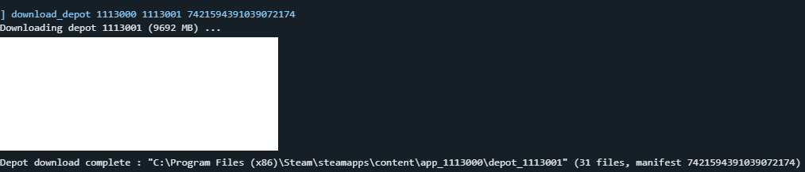

# Installing Requirements

## Downloading the game

Press the windows key + r on your keyboard (or open your web browser of choice (or press the windows key and search for run)) and type `steam://open/console` into it. 

Steam should open into a new console tab. type `download_depot 1113000 1113001 7421594391039072174` and wait for it to finish.

The game files will be in `\steamapps\content\app_1113000\depot_1113001`  and you can do whatever you want with the folder (for example: I moved it to my D: drive and renamed it to "P4G 32 bit")

## Downloading P4GCEP

Go [here](https://archive.org/details/p4g-cep-32-bit-version) to download it\
(The [og download](https://www.nexusmods.com/persona4golden/mods/11?tab=files) is from Nexus Mods but you have to make an account to download)\
Extract to a folder like C:/Mods\
Make sure not to put it in any admin-protected folder or onedrive folder, such as the Desktop, Documents, Program Files, etc

## Downloading Prerequisites

Download the latest version of Persona.PrerequisiteInstaller [here](https://github.com/Pixelguin/Persona.PrerequisiteInstaller) and run it.


DO NOT USE THE VERSION IN THE SETUP FOLDER AS IT IS OUTDATED


Select which mode you want and enter the admin password for all of the prompts
